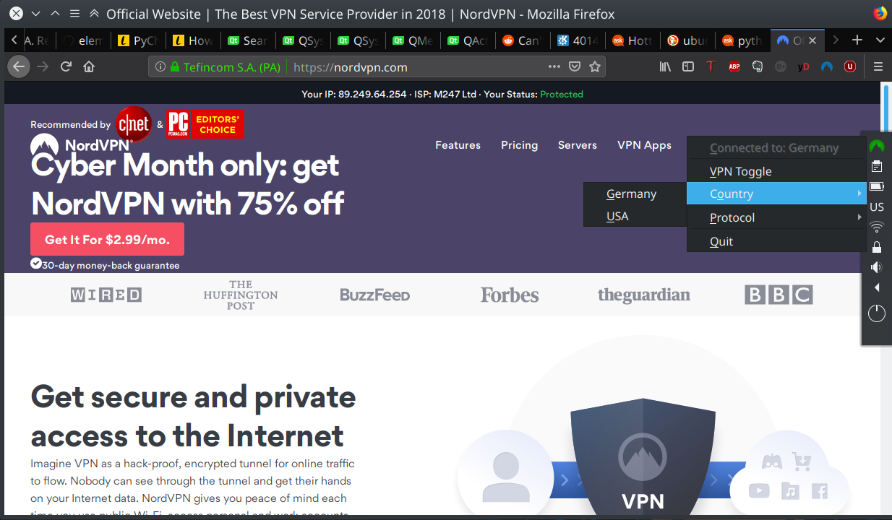

# Nordling
A system tray icon for GNU/Linux that helps simply control NordVPN client. Written in Python3 and PyQt5, tested in Kubuntu 18.10.

My first, ever, FOSS project, so I'm learning the ropes.

# Install & Run
### Dependencies
The script requires:
* Python 3.6.6 + PyQt5 5.6.0
* Official NordVPN release

### Installation
Just run `sh install.sh`. The script is currently designed to just be run by user, without any special privileges. 
Hence, it installs to a user directory.

### Running
In GNOME and KDE, the "Nordling VPN Tray" should appear in the launcher automatically.
If not, one can launch it by running the `launch_nordling.sh` script. 

There are monochrome (dark theme) icons implemented.
Currently hardcoded, they soon will be selectable as an argument on launch.

